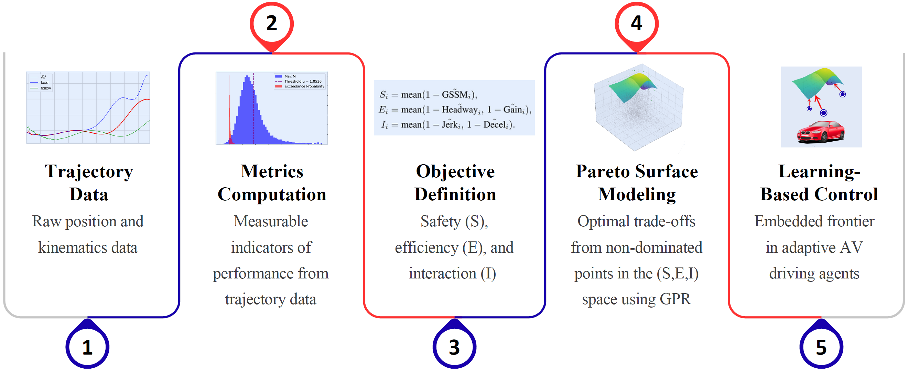

# Learning the Pareto Space of Multi-Objective Autonomous Driving: A Modular, Data-Driven Approach

This repository contains the code for the paper  
**“Learning the Pareto Space of Multi-Objective Autonomous Driving: A Modular, Data-Driven Approach”**,  
which initiates **Phase II** of our broader research agenda on consensus-aware autonomous vehicle (AV) behavior.

Phase II advances the empirical foundations established in earlier work by setting up a continuous learning Pareto surface across multiple behavioral objectives (Safety, Efficiency, and Interaction) using a modular per-timestep pipeline built on the Third Generation Simulation (TGSIM) datasets.

---

## Repository Structure

### AV Driving Metrics
Details the preprocessing pipeline used to generate per-timestep AV behavioral metrics. The workflow covers dataset preparation, AV–agent detection through Tesla Vision zones, and the calculation of performance metrics including:
- Generalized Surrogate Safety Metric (GSSM) following the methodology outlined in Jiao et al. (2025).

   [Link to the paper](https://arxiv.org/abs/2505.13556) [Link to the Github repository](https://github.com/Yiru-Jiao/GSSM)

   

- Headway
- String stability
- Jerk
- Deceleration Intensity

(Notebook: [**AV_Metrics_Timesteps.ipynb**](AV_Metrics_Timesteps.ipynb))

### Pareto
Implements the complete multi-objective learning pipeline:
- Cleans and normalizes inputs  
- Builds composite Safety, Efficiency, and Interaction objectives  
- Computes the empirical Pareto front  
- Performs contextual KNN imputation  
- Fits a Gaussian Process Regression (GPR) model to learn the Pareto surface  
- Generates 3D Pareto surface and convex hull visualizations  

(Notebook: [**Pareto_Timesteps.ipynb**](*Pareto_Timesteps.ipynb))

---

## Data Dependencies  
The analysis depends on two large TGSIM datasets (not included in this repository):

1. Foggy Bottom (urban mixed traffic):  
   https://catalog.data.gov/dataset/third-generation-simulation-data-tgsim-foggy-bottom-trajectories

2. I-395 (highway, Level-2 AVs):  
   https://catalog.data.gov/dataset/third-generation-simulation-data-tgsim-i-395-trajectories

These datasets must be downloaded locally before running the notebooks.

---

## Usage

1. Download both TGSIM datasets and store them locally.  
2. Open and run the notebooks in the following order:
   - `AV_Metrics_Timesteps.ipynb`
   - `Pareto_Timesteps.ipynb`
3. Generated CSV files and figures will be placed in the working directory.You can skip exporting intermediary datasets if they're not needed. 

---

## Citation

If you use this repository or its methods, please cite:

Elayan, M. & Kontar, W. (2025). *Learning the Pareto Space of Multi-Objective Autonomous Driving: A Modular, Data-Driven Approach.*

Updated citation details will be added once the paper is published.

---

## License

This project is released under the MIT License.
